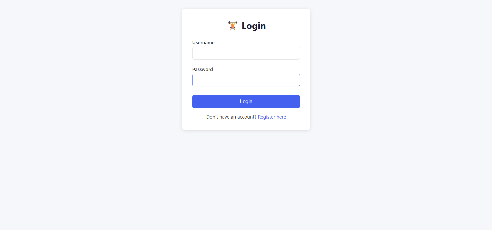
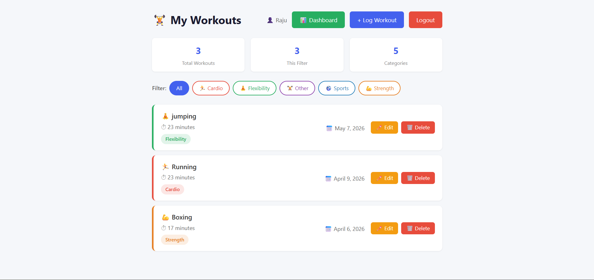
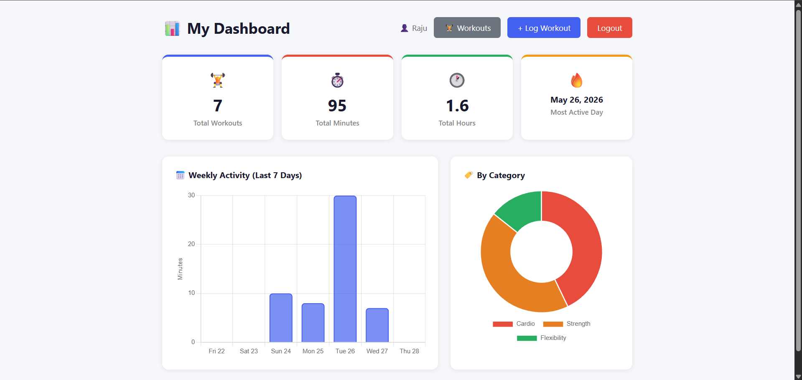
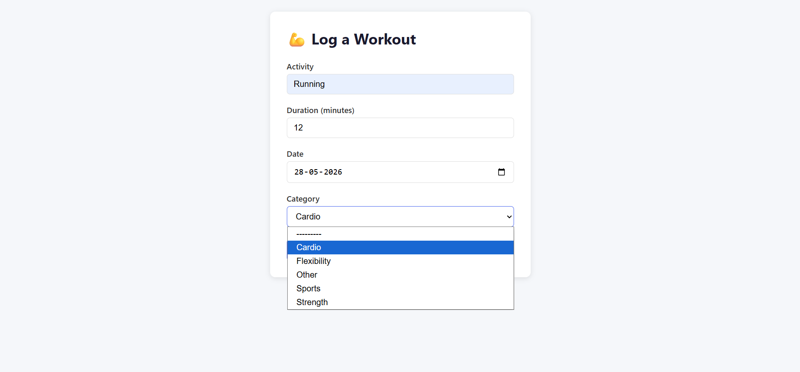

# 🏋️ FitTrack — Personal Fitness Tracker Web Application


> A full-stack fitness tracking web application built with Python Django — featuring user authentication, workout management, category filtering, interactive charts, and a REST API.

🌐 **Live Demo:** [sanjayn.pythonanywhere.com](https://sanjayn.pythonanywhere.com)
📂 **GitHub:** [github.com/sanjay-narra/fitness-tracker](https://github.com/sanjay-narra/fitness-tracker)

---

## 🖼️ Screenshots

| Login | Workouts |
|-------|----------|
|  |  |

| Dashboard | Add Workout |
|-----------|-------------|
|  |  |

---

## ✨ Features

### 🔐 User Authentication
- Secure user registration and login system
- Each user has their own private workout data
- Session-based authentication
- Logout functionality

### 💪 Workout Management
- Log workouts with activity name, duration, and date
- Edit existing workouts
- Delete workouts with confirmation page
- Workouts sorted by most recent first

### 🏷️ Workout Categories
- Separate Category model with ForeignKey relationship
- 5 default categories — Cardio, Strength, Flexibility, Sports, Other
- Color-coded badges for each category
- Filter workouts by category with one click
- Categories manageable through Django admin panel

### 📊 Interactive Dashboard
- Weekly activity bar chart (last 7 days)
- Category breakdown doughnut chart
- Stats cards — Total Workouts, Total Minutes, Total Hours, Most Active Day
- Powered by Chart.js
- Real-time data from Django backend

### 🚀 REST API
- Full CRUD API for workouts
- Categories listing endpoint
- Summary statistics endpoint
- Secured with session authentication
- Built with Django REST Framework

---

## 🛠️ Tech Stack

| Layer | Technology | Purpose |
|-------|------------|---------|
| **Backend** | Python 3.13 | Core programming language |
| **Framework** | Django 4.2 | Web framework |
| **API** | Django REST Framework | REST API building |
| **Database** | SQLite | Data storage |
| **Frontend** | HTML5, CSS3 | Templates and styling |
| **Charts** | Chart.js | Interactive data visualization |
| **Deployment** | PythonAnywhere | Cloud hosting |
| **Version Control** | Git + GitHub | Source code management |

---

## 📁 Project Architecture

```
fitness_tracker/
├── fitness_project/            # Django project configuration
│   ├── settings.py             # Project settings
│   ├── urls.py                 # Root URL configuration
│   └── wsgi.py                 # WSGI deployment entry point
│
├── tracker/                    # Main application
│   ├── models.py               # Category & Workout models
│   ├── views.py                # Web views & dashboard logic
│   ├── forms.py                # Django ModelForms
│   ├── admin.py                # Customized admin panel
│   ├── serializers.py          # DRF serializers for API
│   ├── api_views.py            # REST API views
│   ├── api_urls.py             # API URL patterns
│   ├── urls.py                 # App URL patterns
│   ├── migrations/             # Database migration history
│   └── templates/tracker/      # HTML templates
│       ├── workout_list.html   # Workout list with category filter
│       ├── dashboard.html      # Charts and statistics dashboard
│       ├── add_workout.html    # Add new workout form
│       ├── edit_workout.html   # Edit workout form
│       └── delete_workout.html # Delete confirmation page
│
├── accounts/                   # Authentication application
│   ├── views.py                # Login, register, logout views
│   ├── urls.py                 # Auth URL patterns
│   └── templates/accounts/     # Login & register templates
│
├── manage.py                   # Django management utility
└── requirements.txt            # Python dependencies
```

---

## 🔌 REST API Endpoints

| Method | Endpoint | Description | Auth Required |
|--------|----------|-------------|---------------|
| GET | `/api/workouts/` | List all user workouts | ✅ |
| POST | `/api/workouts/` | Create new workout | ✅ |
| GET | `/api/workouts/<id>/` | Get single workout | ✅ |
| PUT | `/api/workouts/<id>/` | Update workout | ✅ |
| DELETE | `/api/workouts/<id>/` | Delete workout | ✅ |
| GET | `/api/categories/` | List all categories | ✅ |
| GET | `/api/summary/` | Get stats summary | ✅ |

### Sample API Response — GET /api/workouts/

```json
{
    "count": 5,
    "results": [
        {
            "id": 1,
            "activity": "Morning Run",
            "duration": 30,
            "date": "2026-04-11",
            "category_name": "Cardio",
            "category_color": "#e74c3c",
            "category_icon": "🏃",
            "username": "sanjay"
        }
    ]
}
```

---

## ⚙️ Local Setup

### Prerequisites
- Python 3.8 or higher
- pip
- Git

### Installation Steps

**1. Clone the repository:**
```bash
git clone https://github.com/Sanjay284-beep/fitness-tracker.git
cd fitness-tracker
```

**2. Create and activate virtual environment:**
```bash
# Windows
python -m venv venv
venv\Scripts\activate

# macOS/Linux
python3 -m venv venv
source venv/bin/activate
```

**3. Install dependencies:**
```bash
pip install -r requirements.txt
```

**4. Apply database migrations:**
```bash
python manage.py migrate
```

**5. Add default categories:**
```bash
python manage.py shell
```
```python
from tracker.models import Category
Category.objects.create(name='Cardio', color='#e74c3c', icon='🏃')
Category.objects.create(name='Strength', color='#e67e22', icon='💪')
Category.objects.create(name='Flexibility', color='#27ae60', icon='🧘')
Category.objects.create(name='Sports', color='#2980b9', icon='⚽')
Category.objects.create(name='Other', color='#8e44ad', icon='🏋️')
exit()
```

**6. Run the development server:**
```bash
python manage.py runserver
```

Visit **http://127.0.0.1:8000** in your browser.

---

## 🚀 Deployment

Deployed on **PythonAnywhere** free tier:
- Configured WSGI file to point to Django settings
- Set `ALLOWED_HOSTS`, `STATIC_ROOT`, `DEBUG=False` for production
- Ran `collectstatic` to serve static files

---

## 🧠 Key Concepts Demonstrated

### Backend
- Django MVT Architecture
- ForeignKey Relationships with `SET_NULL`
- Query Optimization using `select_related()`
- Django ORM Aggregations — `Sum()`, `Count()`, `annotate()`
- Class-based API Views with Django REST Framework
- Login Required Decorator for view protection

### Frontend
- Django Template Language
- Chart.js Integration with backend JSON data
- Responsive CSS Grid layout
- Dynamic category color styling from database

### DevOps
- Git version control with meaningful commit history
- PythonAnywhere cloud deployment
- Virtual environment management
- Static files with `collectstatic`

---

## 🔮 Future Improvements

- [ ] Workout streak tracking
- [ ] Weekly/monthly goals
- [ ] Export workouts as CSV
- [ ] Social features — follow friends
- [ ] Mobile app using the REST API
- [ ] PostgreSQL for production
- [ ] Docker containerization
- [ ] CI/CD with GitHub Actions

---

## 🏆 What I Learned

1. **Project setup** — virtual environments, Django project structure
2. **Database modeling** — models, migrations, relationships
3. **Authentication** — Django's built-in auth system
4. **CRUD operations** — forms, views, templates
5. **REST APIs** — Django REST Framework, serializers
6. **Data visualization** — Chart.js with Django backend
7. **Deployment** — taking a local project live on the internet
8. **Version control** — Git workflow, GitHub

---

## 📄 License

This project is open source and available under the [MIT License](LICENSE).

---

## 👨‍💻 Author

**Narra Sanjay** — B.Tech Computer Science Engineering (2026)

- 🌐 Live App: [sanjayn.pythonanywhere.com](https://sanjayn.pythonanywhere.com)
- 💻 GitHub: [@Sanjay284-beep](https://github.com/Sanjay284-beep)
- 📧 Email: narrasanjayigy7@gmail.com

---

> Built from scratch with ❤️ — from zero to a fully deployed full-stack web application! 🚀
